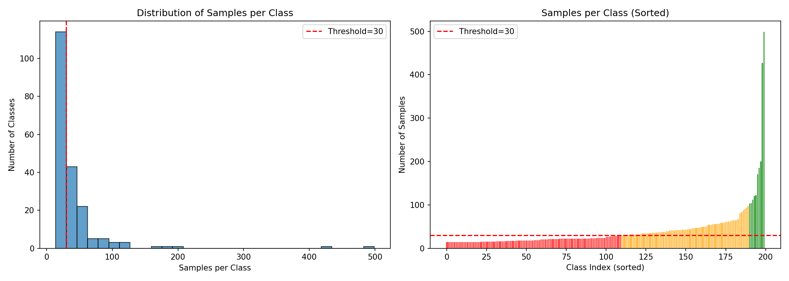

# Vietnamese Sign Language Recognition - Training Guide

## Project Overview

**Repository**: Multi-view Vietnamese Sign Language Recognition using I3D (Inception 3D)

**Goal**: Improve classification accuracy for 200 Vietnamese Sign Language glosses

**Current Status** (2026-04-24):
- Baseline Test Accuracy: **61.48%**
- Target: **>70%**

---

## Problem Analysis

### 1. Data Imbalance (Main Issue)

| Metric | Value |
|--------|-------|
| Total training samples | 7,970 (original) → 9,164 (after augmentation) |
| Number of classes | 200 |
| Max samples/class | 499 (label 47 - "tôi") |
| Min samples/class | 14 → 30 (after augmentation) |
| Imbalance ratio | 35.6x → 16.6x |
| Minority classes (<30 samples) | 110 classes (55%) → 0 classes |

### 2. Overfitting

| Metric | Value |
|--------|-------|
| Train accuracy | ~78% |
| Validation accuracy | ~60% |
| Gap | ~18% (too high) |

### 3. Symptoms
- Many minority classes have **0% accuracy** in testing
- Model biased towards majority classes (tôi, bạn, này, etc.)

---

## Solutions Implemented

### Solution 1: Balanced Sampling

**Theory**: Instead of random sampling, weight each sample inversely proportional to its class frequency. This ensures minority classes are sampled more often during training.

**Methods Available**:
1. `inverse`: weight = N / (n_classes × class_count)
2. `sqrt_inverse`: weight = sqrt(N / (n_classes × class_count)) - less aggressive
3. `effective`: Based on "Class-Balanced Loss" paper (beta=0.9999)

**Implementation**: `dataset/dataloader.py`

```python
def create_balanced_sampler(dataset, method='inverse'):
    # Calculate class weights
    class_weights = {cls: n_samples / (n_classes * count) for cls, count in class_counts.items()}
    
    # Create sample weights
    sample_weights = [class_weights[label] for label in labels]
    
    # Return WeightedRandomSampler
    return WeightedRandomSampler(weights=sample_weights, num_samples=len(labels), replacement=True)
```

**Config Usage**:
```yaml
training:
  balanced_sampling: true
  balanced_method: inverse  # Options: inverse, sqrt_inverse, effective
```

### Solution 2: Offline Data Augmentation

**Theory**: Generate new training samples for minority classes using video augmentation techniques.

**Augmentation Techniques**:
1. **Brightness adjustment**: Random delta in [-30, +30]
2. **Contrast adjustment**: Random alpha in [0.8, 1.2]
3. **Gaussian blur**: Kernel size 3-7
4. **Gaussian noise**: Noise level ~10
5. **Random crop**: Scale 85-95%, resize back
6. **Time warping**: Speed 0.8x-1.2x (temporal stretching)

**Implementation**: `tools/offline_augmentation.py`

```bash
python tools/offline_augmentation.py \
    --data_type 200 \
    --target_samples 30 \
    --video_dir data/my_data \
    --output_dir data/my_data_augmented
```

**Results**:
- Generated: **1,194 new videos**
- Min samples/class: 14 → **30**
- Total training samples: 7,970 → **9,164**

---

## File Structure

```
multi_vsl_server/
├── configs/my_data/
│   ├── my_data_200.yaml              # Original config
│   ├── my_data_200_balanced.yaml     # Balanced sampling only
│   └── my_data_200_augmented.yaml    # Balanced + Augmented data
├── data/
│   ├── my_data/                      # Video files (16,986 total)
│   │   ├── ID1_gloss_0.mp4          # Original videos
│   │   └── ID1_gloss_0_aug0.mp4     # Augmented videos (*_aug*)
│   ├── my_data_200/
│   │   ├── train_200.csv            # Current training CSV (augmented)
│   │   ├── train_200_original.csv   # Backup of original
│   │   ├── train_200_augmented.csv  # Augmented CSV copy
│   │   ├── val_200.csv              # Validation CSV
│   │   └── test_200.csv             # Test CSV
│   └── my_data_augmented/           # Augmented data output folder
├── tools/
│   ├── data_analysis.py             # Distribution analysis
│   ├── balanced_sampler.py          # Standalone balanced sampler
│   └── offline_augmentation.py      # Video augmentation script
├── analysis_output/
│   ├── augmentation_plan_200.csv    # Classes needing augmentation
│   ├── distribution_200.png         # Distribution visualization
│   └── full_report_200.csv          # Full class report
└── dataset/
    ├── dataloader.py                # Modified with balanced sampler
    └── i3d.py                       # Added labels property
```

---

## Training Commands

### Step 1: Balanced Sampling Only (Testing)
```bash
python main.py --config configs/my_data/my_data_200_balanced.yaml
```

### Step 2: Data Analysis
```bash
python tools/data_analysis.py --data_type 200
```

### Step 3: Offline Augmentation
```bash
python tools/offline_augmentation.py --data_type 200 --target_samples 30
```

### Step 4: Training with Augmented Data
```bash
python main.py --config configs/my_data/my_data_200_augmented.yaml
```

---

## Output Locations

| Output | Path |
|--------|------|
| Training log | `log/InceptionI3d/{experiment_name}.log` |
| Checkpoints | `checkpoints/InceptionI3d/{experiment_name}/` |
| WandB | Online dashboard (project: InceptionI3d) |

---

## Experiment Tracking

| Experiment | Config | Status | Test Accuracy |
|------------|--------|--------|---------------|
| Baseline (original) | my_data_200.yaml | Done | 61.48% |
| Balanced Sampling | my_data_200_balanced.yaml | Running | TBD |
| Balanced + Augmented | my_data_200_augmented.yaml | Pending | TBD |

---

## Data Distribution Visualization



- **Red**: Minority classes (<30 samples) - 110 classes → 0 after augmentation
- **Orange**: Balanced (30-100 samples) - 80 classes
- **Green**: Majority (>=100 samples) - 10 classes

---

## Theory References

### Class Imbalance in Deep Learning

1. **Re-sampling Methods**:
   - Oversampling minority classes
   - Undersampling majority classes
   - SMOTE (Synthetic Minority Oversampling)

2. **Re-weighting Methods**:
   - Inverse frequency weighting
   - Effective number of samples (Class-Balanced Loss)
   - Focal Loss

3. **Data Augmentation**:
   - Spatial: crop, flip, rotation, color jitter
   - Temporal: time warping, frame dropping, speed change

### "Nhắm tới distribute cho gloss" (Mentor's advice)

Meaning: **Balance the distribution of glosses** through:
1. Balanced sampling during training
2. Data augmentation for minority classes
3. Weighted loss function

---

## Next Steps

1. **Wait for Step 1 results** (Balanced Sampling)
2. **Compare with baseline** (61.48%)
3. **Run Step 4** (Training with Augmented Data)
4. **Fine-tune** based on results:
   - Try different balanced_method (sqrt_inverse, effective)
   - Adjust target_samples for augmentation
   - Add weighted loss function if needed

---

## Rollback Instructions

### Restore original training data:
```bash
cp data/my_data_200/train_200_original.csv data/my_data_200/train_200.csv
```

### Remove augmented videos:
```bash
rm data/my_data/*_aug*.mp4
```

---

## Contact

- **GitHub**: https://github.com/FrorsttzNguyen/Vietnamese-Sign-Language-HV8
- **Session Date**: 2026-04-24

---

*Document generated by Claude Opus 4.5*
